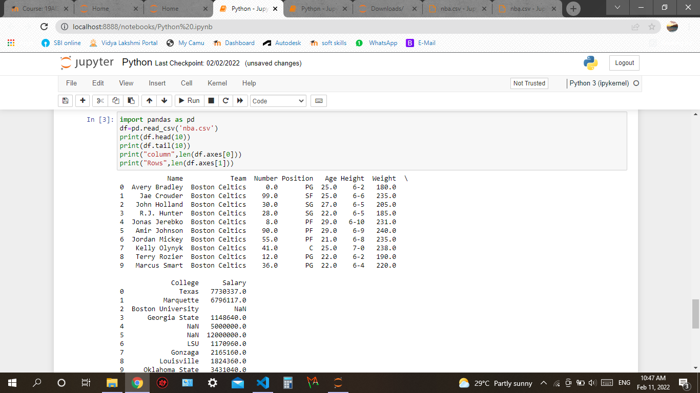
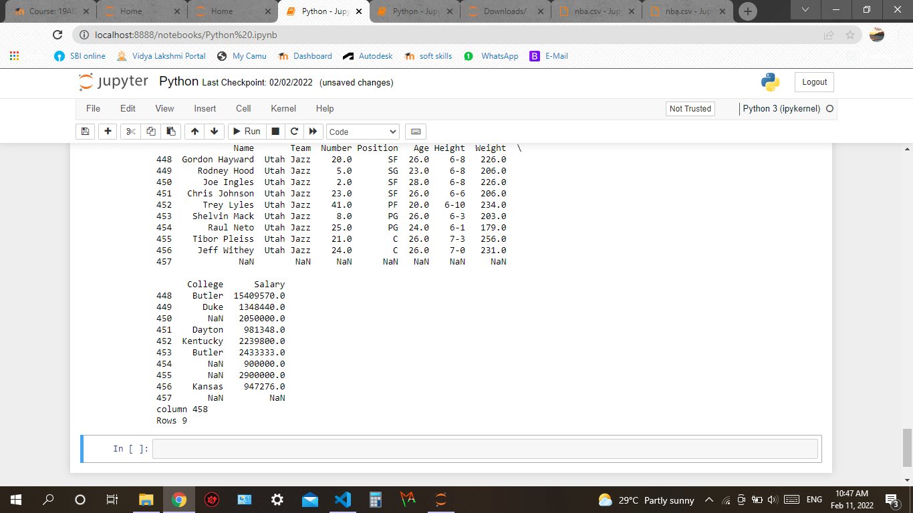

# Read-from-CSV

## AIM:
 To read the contents from a CSV file.
## ALGORITHM:
### Step 1:
Import pandas.
### Step 2:
Read the file using read_csv method.
### Step 3:
Use head and tail method to get the headings and columns.
### Step 4:
Use len() method to get the number of rows and columns.
### Step 5:
Atlast print.

## PROGRAM:
```
Nmae:J,Archana priya
Reg.no:212221230007

import pandas as pd
df=pd.read_csv('nba.csv')
print(df.head(10))
print(df.tail(10))
print("column",len(df.axes[0]))
print("Rows",len(df.axes[1]))
```

## OUTPUT:



## RESULT:
The contents from a csv file has been successfully read.
